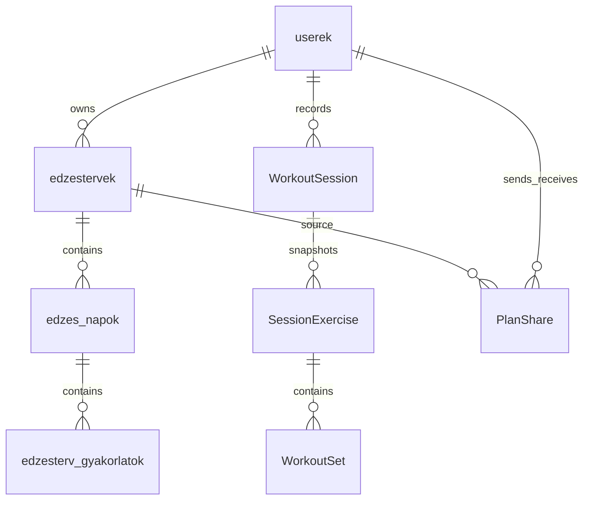

# GymProject

React/Vite frontend és NestJS/Prisma/PostgreSQL backend edzéstervekkel, edzésnaplóval és tervmegosztással.

## Indítás

1. Másold a `Backend/.env.example` fájlt `Backend/.env` néven, és add meg a PostgreSQL `DATABASE_URL`, `DIRECT_URL`, `FRONTEND_URL` és legalább 32 karakteres `JWT_SECRET` értékét. A példafájl nem titok.
2. `cd Backend && npm ci && npx prisma migrate deploy && npm run prisma:seed && npm run build`
3. Másik terminálban: `cd Frontend && npm ci && npm run dev`

A backend Swagger felülete: `/api/docs`. A seed csak ártalmatlan katalógusadatot hoz létre.

## Ellenőrzések

`Backend`: `npm run lint`, `npm test`, `npm run build`.

`Frontend`: `npm run lint`, `npm run build`.

A GitHub Actions minden PR-en és `main` push-on futtatja ezeket. Az adatbázist igénylő teljes E2E futtatás helyi/CI PostgreSQL szolgáltatást igényel; ehhez jelenleg nincs bekötött szolgáltatás.

## Biztonság és architektúra

Az access és refresh token HttpOnly cookie-ban van; a refresh token hash-elve, rotációval tárolódik. CORS a `FRONTEND_URL` értékére korlátozott, a backend Helmetet, globális DTO-validációt és rate limitet használ. A régi `X-User-Id` alapú nap- és tervgyakorlat-végpontok nincsenek az alkalmazásba kötve: tervet a tranzakciós `edzestervek` API ment. Privát adatok és jelszóhash nem kerülnek publikus válaszba.

V1: tranzakciós tervmentés, egy aktív edzés/felhasználó, sorozatrögzítés, előzmény és volumen-statisztika. V2: username-alapú keresés, blokkolás, meghívó, előnézethez szükséges teljes tervadat, idempotens elfogadási másolat és értesítések.

Ha korábban a követett `Backend/.env` valódi hitelesítő adatot tartalmazott, azokat cserélni kell; a git-előzmények átírása nem történt meg.
